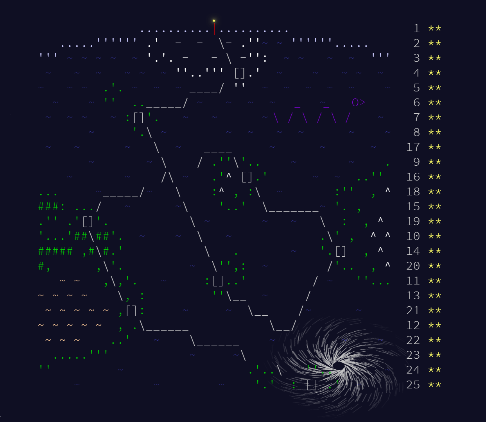
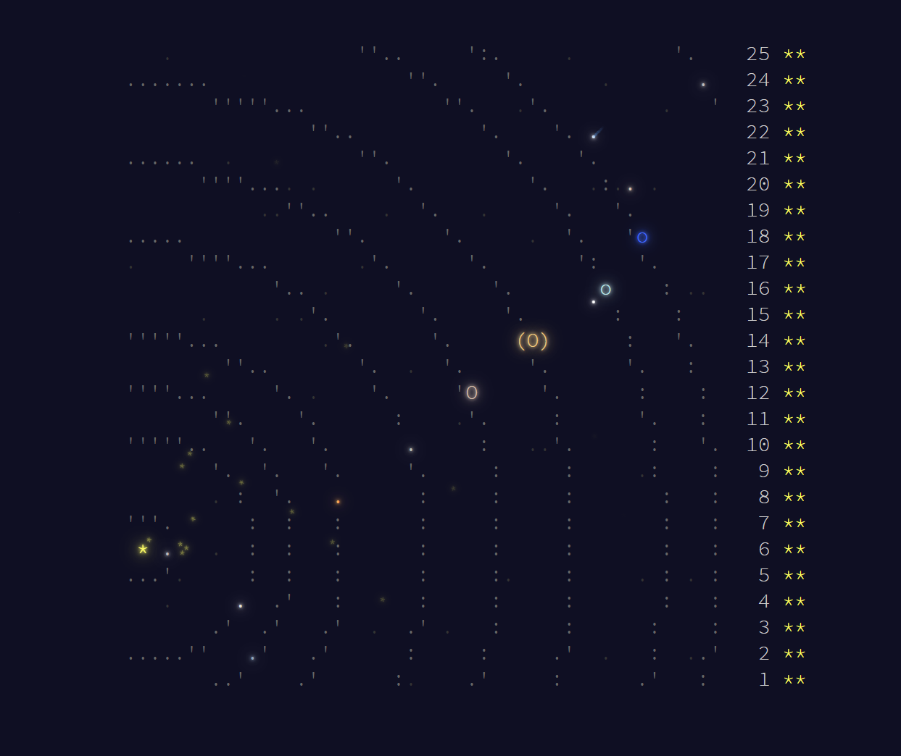
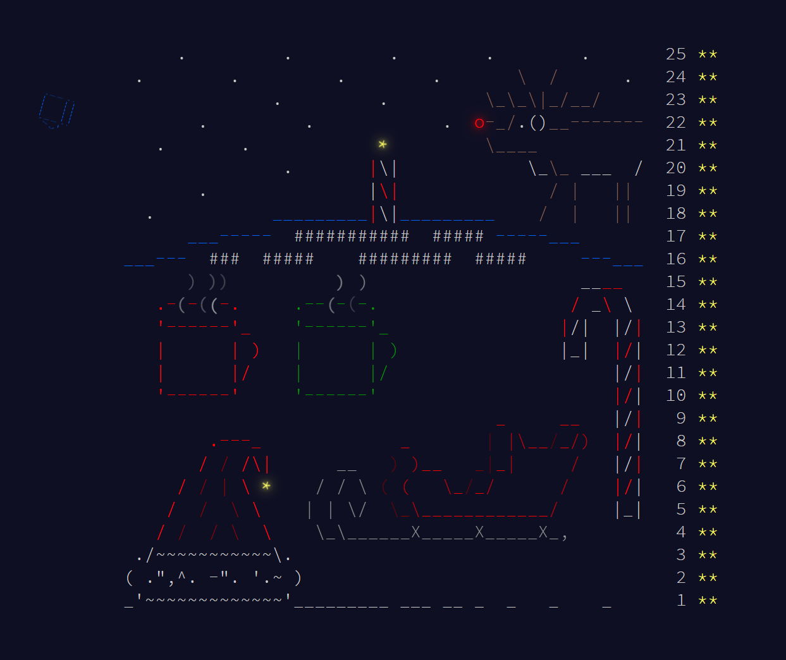
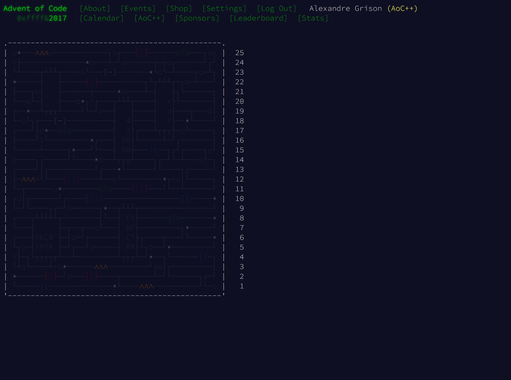
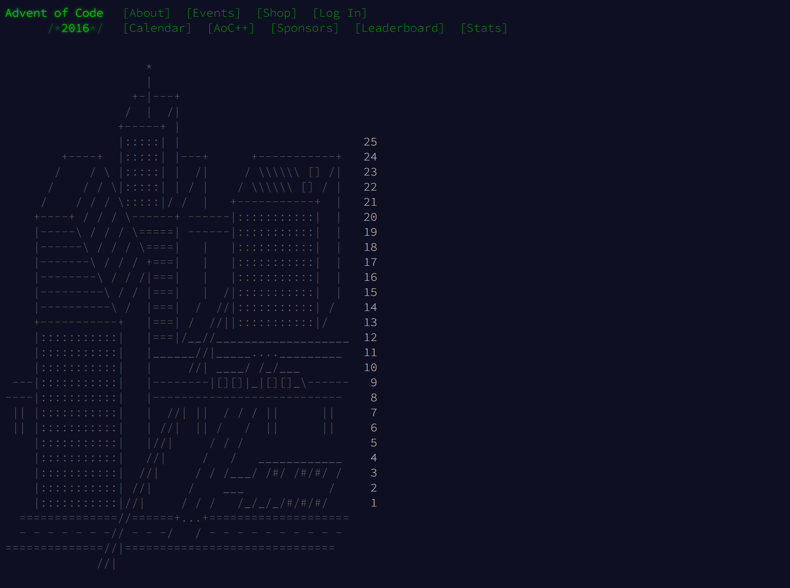
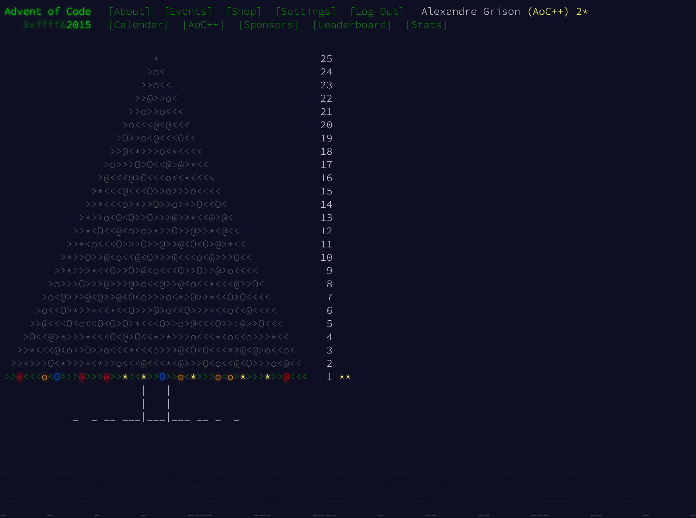

# Advent Of Code

## 2021


```text
🎅 === Advent of Code 2021 === 🎅

🎄 --- Day 01: Sonar Sweep ---
  🌟 Part 1: 1581  (13.3ms)
  🌟 Part 2: 1618  (2.62ms)
  
🎄 --- Day 2: Dive! ---
  🌟 Part 1: 2117664     (12.6ms)
  🌟 Part 2: 2073416724  (3.14ms)
  
🎄 --- Day 3: Binary Diagnostic ---
  🌟 Part 1: 1082324  (7.91ms)
  🌟 Part 2: 1353024  (2.42ms)
  
🎄 --- Day 4: Giant Squid ---
  🌟 Part 1: 58374  (40ms)
  🌟 Part 2: 11377  (12.4ms)
    
🎄 --- Day 5: Hydrothermal Venture ---
  🌟 Part 1: 6113   (60.0ms)
  🌟 Part 2: 20373  (50.1ms)
  
🎄 --- Day 6: Lanternfish ---
  🌟 Part 1: 351188         (27.9ms)
  🌟 Part 2: 1595779846729  (2.00ms)
  
🎄 --- Day 7: The Treachery of Whales ---
  🌟 Part 1: 341534    (22.8ms)
  🌟 Part 2: 93397707  (29.8ms)

🎄 --- Day 8: Seven Segment Search ---
  🌟 Part 1: 539      (1.93ms)
  🌟 Part 2: 1084606  (6.55ms)
  
🎄 ---- Day 9: Smoke Basin ---
  🌟 Part 1: 537      (9.4ms)
  🌟 Part 2: 1142757  (9.9ms)
  
🎄 ---- Day 10: Syntax Scoring ---
  🌟 Part 1: 367227      (3.85ms)
  🌟 Part 2: 3583341858  (2.00ms)

🎄 ---- Day 11: Dumbo Octopus ---
  🌟 Part 1: 1661  (14.9ms)
  🌟 Part 2: 334   (13.2ms)
  
🎄 ---- Day 12: Passage Pathing ---
  🌟 Part 1: 4749    (13.4ms)
  🌟 Part 2: 123054  (95.3ms)
  
🎄 ---- Day 13: Transparent Origami ---
  🌟 Part 1: 602       (3.88ms)
  🌟 Part 2: CAFJHZCK  (6.80us)
  
🎄 ---- Day 14: Extended Polymerization ---
  🌟 Part 1: 2549           (16.7ms)
  🌟 Part 2: 2516901104210  (5.54ms)
  
🎄 ---- Day 15: Chiton ---
  🌟 Part 1: 523   (53.7ms)
  🌟 Part 2: 2876  (1.44s)

🎄 ---- Day 16: Packet Decoder ---
  🌟 Part 1: 1014           (7.50us)
  🌟 Part 2: 1922490999789  (1.70us)
  
🎄 ---- Day 17: Trick Shot ---
  🌟 Part 1: 23005  (1.19ms)
  🌟 Part 2: 2040   (3.10us)

🎄 ---- Day 18: Snailfish ---
  🌟 Part 1: 1946  (43.2ms)
  🌟 Part 2: 3825  (358ms)

🎄 ---- Day 19: Beacon Scanner ---
  🌟 Part 1: 479    (458us)
  🌟 Part 2: 13113  (41.0ms)

🎄 ---- Day 20: Trench Map ---
  🌟 Part 1: 4928   (31.6ms)
  🌟 Part 2: 16605  (402ms)

🎄 ---- Day 21: Dirac Dice ---
  🌟 Part 1: 913560           (920us)
  🌟 Part 2: 110271560863819  (2.74s)

🎄 ---- Day 22: Reactor Reboot ---
  🌟 Part 1: 581108            (658ms)
  🌟 Part 2: 1325473814582641  (29.7ms)
  
🎄 ---- Day 23: Amphipod ---
  🌟 Part 1: 19019  (561ms)
  🌟 Part 2: 47533  (556ms)  
```

## Visualizations

I just discovered p5js, so this year I will try to create some animations about the input I get from AOC.

See: [visualizations](visualizations).

## Screenshots

I gather screenshots at each step (most of) of each years, so that I can make videos about the AOC filling up during december.

See: [screenshots](screenshots).

## Goal

After the 6 last years with Java, Go (finished with Java), OCaml (finished with Java), Python and Clojure (+ some Java), Kotlin, this year I'll be solving the
[Advent of Code](https://adventofcode.com/2021) with **Kotlin** again.

1. A deep dive into Kotlin.
2. Write fast and idiomatic solutions.
3. Using extensions to make code shorter (see [Extensions.kt](https://github.com/agrison/advent-of-code/blob/master/src/main/kotlin/me/grison/aoc/Extensions.kt)).

I am gradually rewriting all previous years solutions in Kotlin because it's a better language for such challenges than the other I used before (except Python, but I'm not doing so much Python so just forgetting how to write some basic stuff).

## Previous years

### 2020 




### 2019



### 2018



### 2017




### 2016




### 2015




Project is already setup with gradle. To run the app:

* Navigate to top-level directory on the command line
* Run `./gradlew run` to run all days for all years
* Run `./gradlew run --args $DAY` to run a specific day in the current year (*2021*, ex: `./gradlew run --args 8` to run the day 8 of *2021*)
* Run `./gradlew run --args $YEAR/*` to run all days in a specific year (ex: `./gradlew run --args 2015/*` to run the year *2015*)
* Run `./gradlew run --args $YEAR/$DAY` to run a specific year & day (ex: `./gradlew run --args 2015/7` to run the day *7* of *2015*)
* Run `./gradlew run --args input-$DAY` to download the input for a specific day for the current year, provided a `cookie.txt` file in `src/main/resources.txt` which contains your Advent of Code cookie  (ex: `./gradlew run --args input-6` to run the day *6* of *2021*)
* Run `./gradlew run --args input-$YEAR/$DAY` to download the input for a specific day in a specific year, provided a `cookie.txt` file in `src/main/resources.txt` which contains your Advent of Code cookie  (ex: `./gradlew run --args input-2015/7` to run the day *7* of *2015*)

### Testing

* Navigate to top-level directory on the command line
* Run `./gradlew test`
* Add `--info`, `--debug` or `--stacktrace` flags for more output

##### Test input

By default, instantiations of `Day` classes in tests will use the input files in `src/test/resources`, _not_ those in `src/main/resources`.
This hopefully gives you flexibility - you could either just copy the real input into `src/test/resources` if you want to test
the actual answers, or you could add a file of test data based on the examples given on the Advent of Code description for the day.
The stub `Day01Test` class shows a test of the functionality of `Day01` where the test input differs from the actual input.

### Architecture

* Inputs go into `src/main/resources` and follow the naming convention `X.txt` where X is like `01`, `02` and so on
* Solutions go into `src/main/kotlin/days` and extend the `Day` abstract class, calling its constructor with their day number 
* Solutions follow the naming convention `DayX`
* It is assumed all solutions will have two parts but share the same input
* Input is exposed in the solution classes in two forms - `inputList` and `inputString`
* Day 1 solution class and input file are stubbed as a guide on how to extend the project,
and how you can use the `inputList` and `inputString` mentioned above
* To get started simply replace `src/main/01.txt` with the real input and the solutions in `Day01` with your own
* A Day 1 test class also exists, mostly to show a few hamcrest matchers, and how test input files can differ from actual ones (see **Test input** section above).
To get started with testing you can edit this class, and the input file at `src/test/resources/01.txt`
